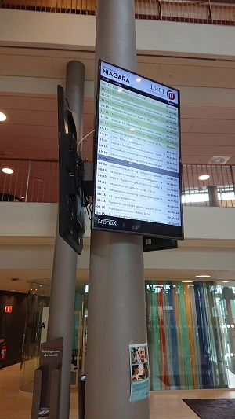

# Kronox

This code is used to view Kronox data for a specific building on a Full HD screen in portrait mode.
In my case, it runs on a remotely controlled Raspberry Pi that downloads a jarfiles and runs them or shows webpages (another story). 
(You can run the code from any computer with a screen in portrait mode.)

Change in the file Constants.java and some of the images in the assets directory to adapt it.

The jarfile should run directly if you have java jre or jdk istalled on the computer.
/L

At Malmö University, it looks like this:

